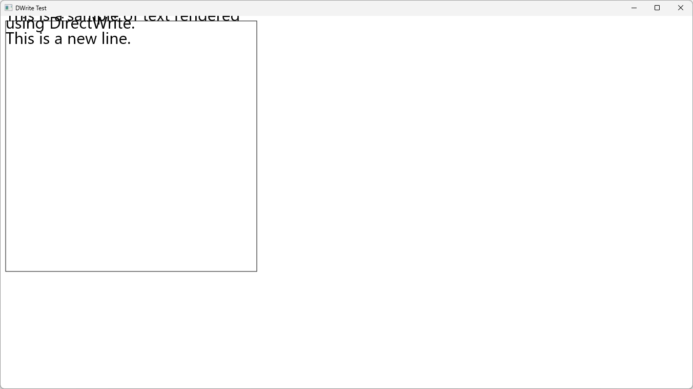
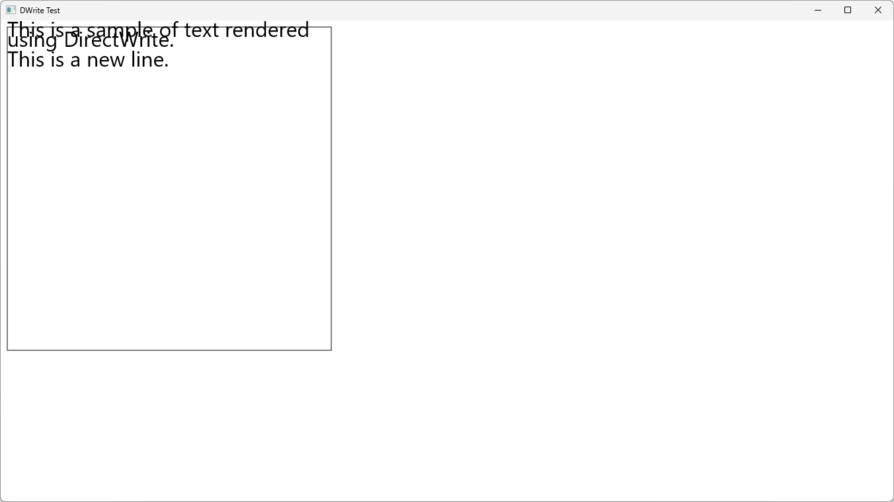
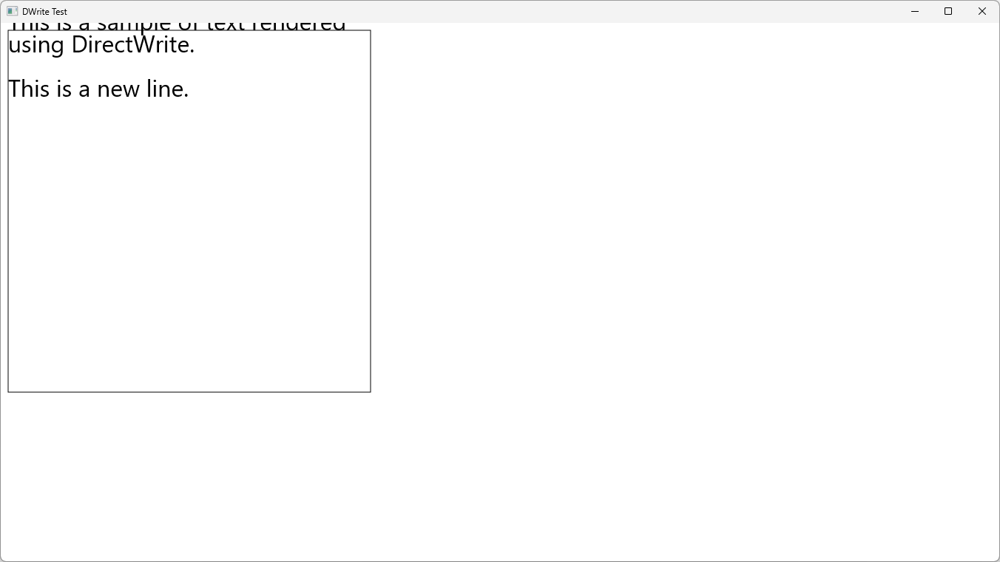
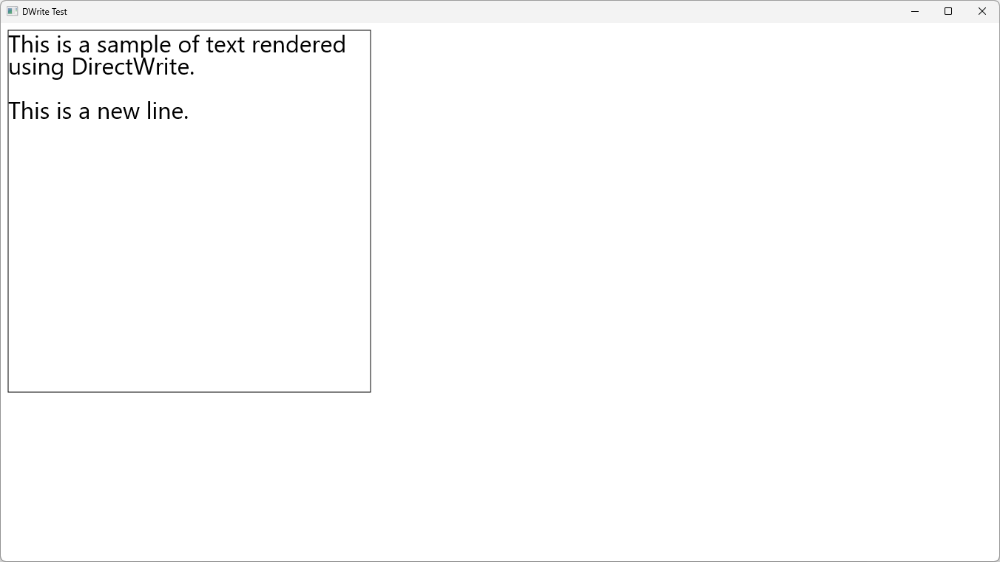
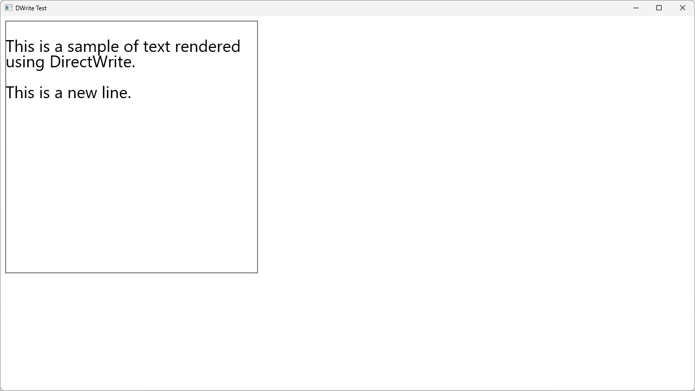
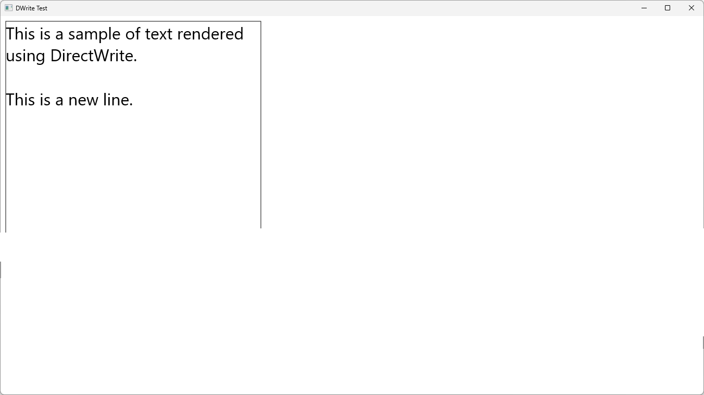
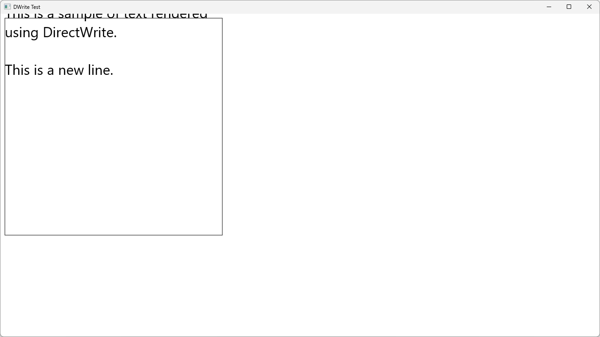
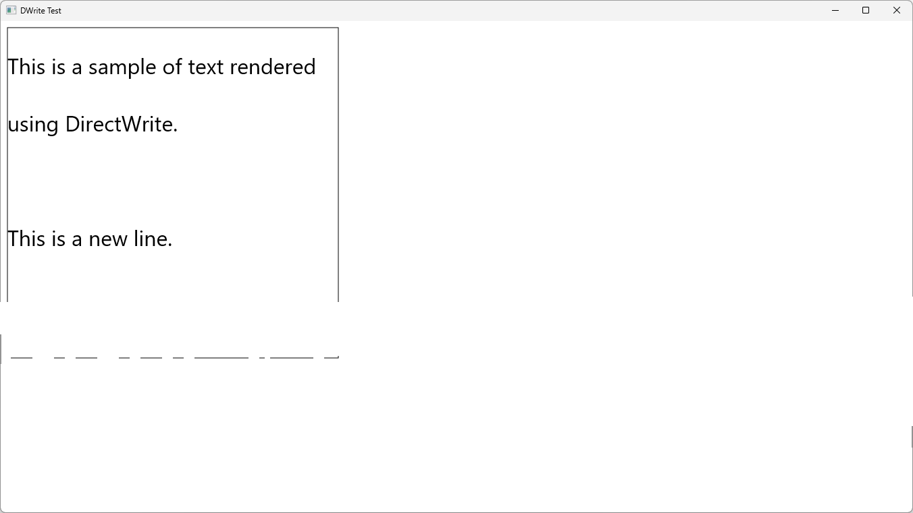
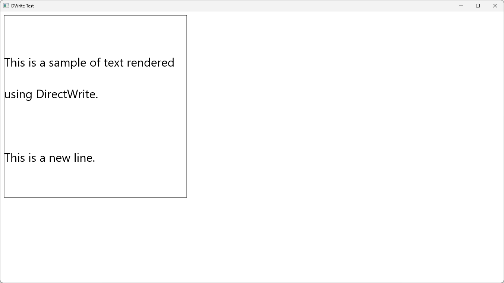

# IDWriteTextFormat::SetLineSpacing

## MSDN
- [IDWriteTextFormat::SetLineSpacing method](https://docs.microsoft.com/en-us/windows/win32/api/dwrite/nf-dwrite-idwritetextformat-setlinespacing)
- [DWRITE_LINE_SPACING enumeration](https://docs.microsoft.com/en-us/windows/win32/api/dwrite/ne-dwrite-dwrite_line_spacing)

## Description
```cpp
HRESULT SetLineSpacing(DWRITE_LINE_SPACING_METHOD lineSpacingMethod, FLOAT lineSpacing, FLOAT baseline);

typedef enum DWRITE_LINE_SPACING_METHOD {
  DWRITE_LINE_SPACING_METHOD_DEFAULT,
  DWRITE_LINE_SPACING_METHOD_UNIFORM,
  DWRITE_LINE_SPACING_METHOD_PROPORTIONAL
} ;
```

## Result

note: font size = 32.0f

UNIFORM, lineSpacing = 15.0f, baseline = 0.0f


UNIFORM, lineSpacing = 15.0f, baseline = 15.0f


UNIFORM, lineSpacing = 30.0f, baseline = 0.0f


UNIFORM, lineSpacing = 30.0f, baseline = 30.0f


UNIFORM, lineSpacing = 30.0f, baseline = 60.0f


DEFAULT, lineSpacing = 1.0f, baseline = 0.0f


DEFAULT, lineSpacing = 2.0f, baseline = 2.0f


PROPORTIONAL, lineSpacing = 1.0f, baseline = 0.0f


PROPORTIONAL, lineSpacing = 2.0f, baseline = 2.0f


PROPORTIONAL, lineSpacing = 2.0f, baseline = 4.0f
