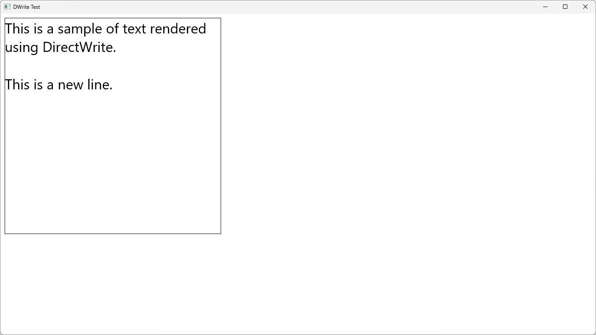

# IDWriteTextFormat::SetParagraphAlignment

## MSDN
- [IDWriteTextFormat::SetParagraphAlignment method](https://docs.microsoft.com/en-us/windows/win32/api/dwrite/nf-dwrite-idwritetextformat-setparagraphalignment)
- [DWRITE_PARAGRAPH_ALIGNMENT enumeration](https://docs.microsoft.com/en-us/windows/win32/api/dwrite/ne-dwrite-dwrite_paragraph_alignment)

## Description
```cpp
HRESULT SetParagraphAlignment(DWRITE_PARAGRAPH_ALIGNMENT paragraphAlignment);

typedef enum DWRITE_PARAGRAPH_ALIGNMENT {
  DWRITE_PARAGRAPH_ALIGNMENT_NEAR,
  DWRITE_PARAGRAPH_ALIGNMENT_FAR,
  DWRITE_PARAGRAPH_ALIGNMENT_CENTER
} ;
```

## Result
NEAR


CENTER


FAR


FlowDirection: BottomToTop, ParagraphAlignment: NEAR


FlowDirection: BottomToTop, ParagraphAlignment: FAR
