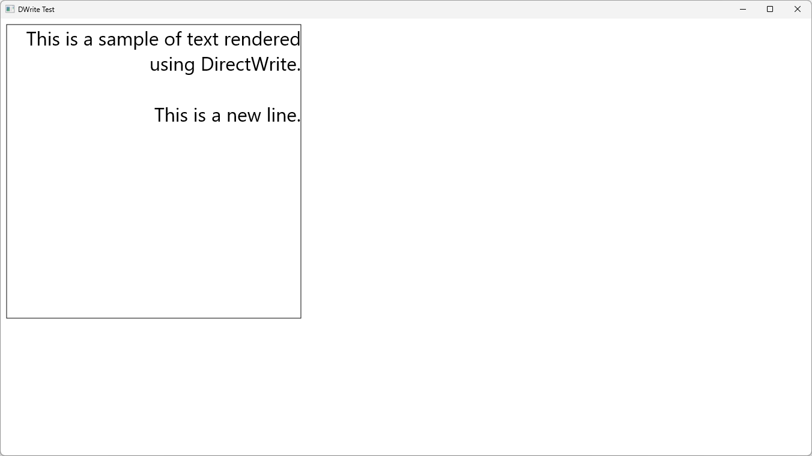
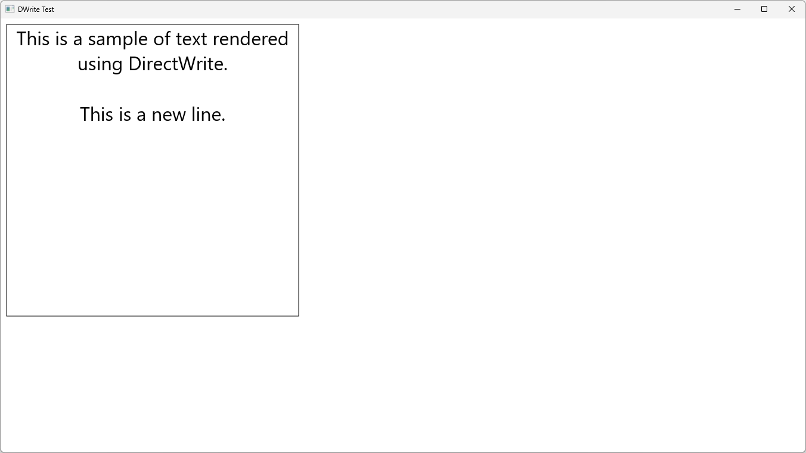
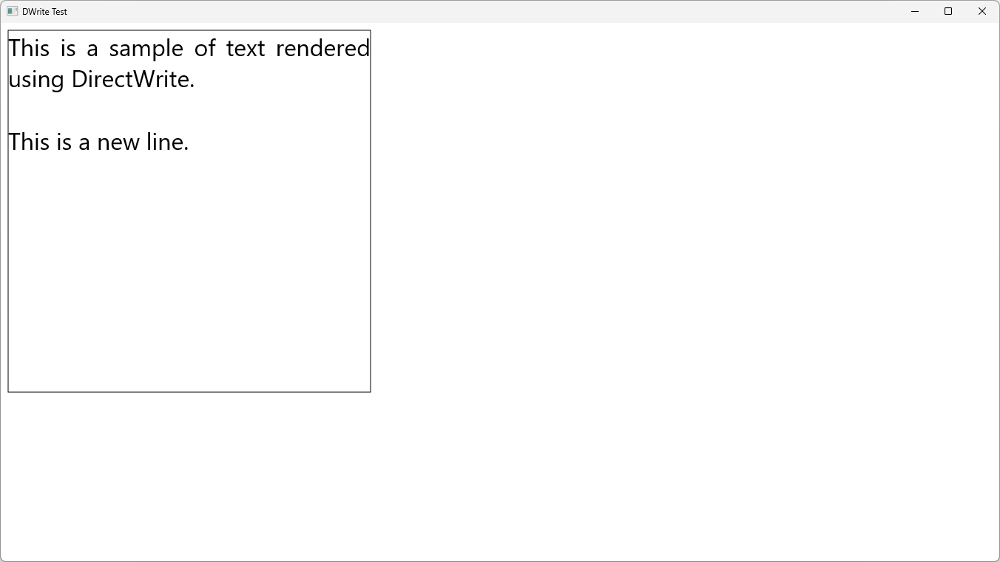
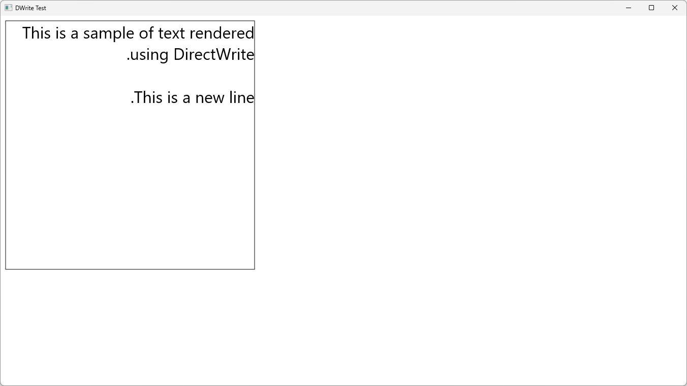
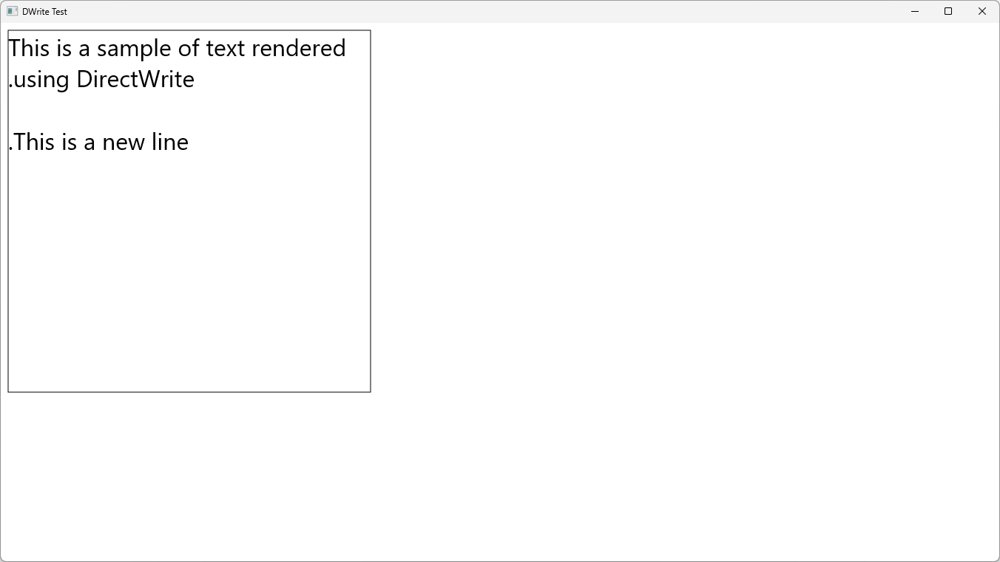

# IDWriteTextFormat::SetTextAlignment

## MSDN
- [IDWriteTextFormat::SetTextAlignment method](https://docs.microsoft.com/en-us/windows/win32/api/dwrite/nf-dwrite-idwritetextformat-settextalignment)
- [DWRITE_TEXT_ALIGNMENT enumeration](https://docs.microsoft.com/en-us/windows/win32/api/dwrite/ne-dwrite-dwrite_text_alignment)

## Description
```cpp
HRESULT SetTextAlignment(DWRITE_TEXT_ALIGNMENT textAlignment);

typedef enum DWRITE_TEXT_ALIGNMENT {
  DWRITE_TEXT_ALIGNMENT_LEADING,
  DWRITE_TEXT_ALIGNMENT_TRAILING,
  DWRITE_TEXT_ALIGNMENT_CENTER,
  DWRITE_TEXT_ALIGNMENT_JUSTIFIED
} ;
```

## Result
LEADING


TRAILING


CENTER


JUSTIFIED


ReadingDirection: RightToLeft, TextAlignment: LEADING


ReadingDirection: RightToLeft, TextAlignment: TRAILING
