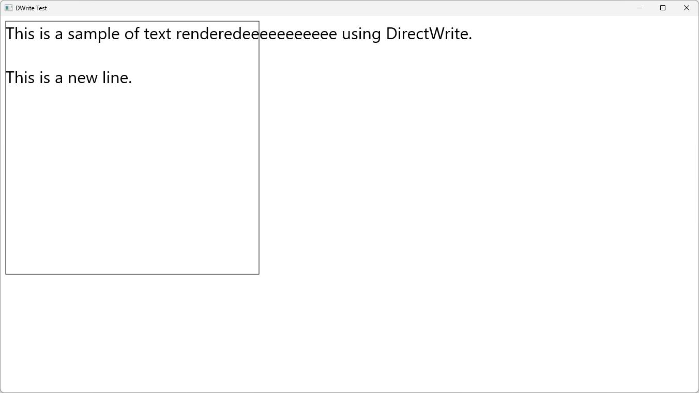
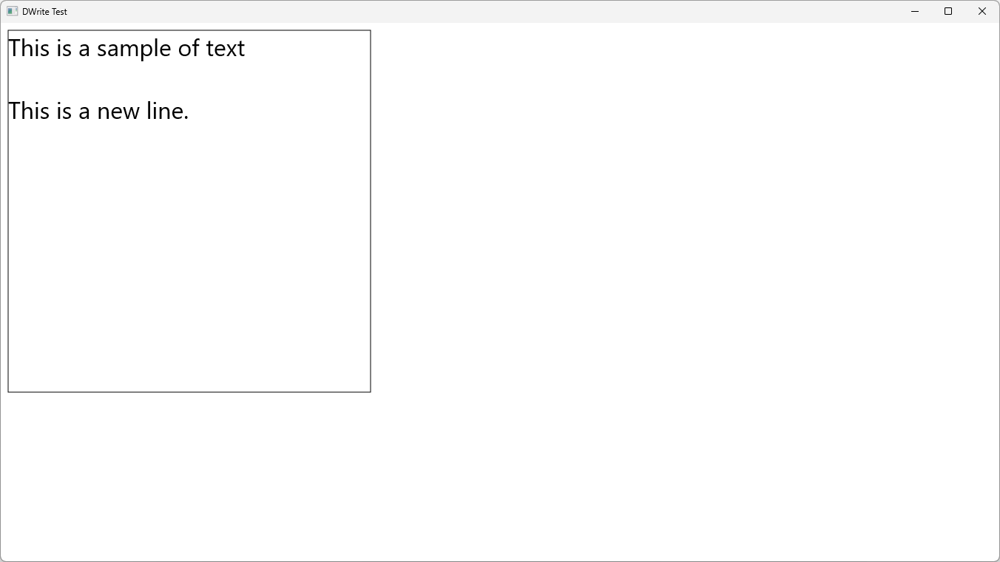

# IDWriteTextFormat::SetTrimming

## MSDN
- [IDWriteTextFormat::SetTrimming method](https://docs.microsoft.com/en-us/windows/win32/api/dwrite/nf-dwrite-idwritetextformat-settrimming)
- [DWRITE_TRIMMING structure](https://docs.microsoft.com/en-us/windows/win32/api/dwrite/ns-dwrite-dwrite_trimming)
- [DWRITE_TRIMMING_GRANULARITY enumeration](https://docs.microsoft.com/en-us/windows/win32/api/dwrite/ne-dwrite-dwrite_trimming_granularity)

## Description
```cpp
HRESULT SetTrimming(
  const DWRITE_TRIMMING *trimmingOptions,
  IDWriteInlineObject   *trimmingSign
);

struct DWRITE_TRIMMING {
  DWRITE_TRIMMING_GRANULARITY granularity;
  UINT32                      delimiter;
  UINT32                      delimiterCount;
};

typedef enum DWRITE_TRIMMING_GRANULARITY {
  DWRITE_TRIMMING_GRANULARITY_NONE,
  DWRITE_TRIMMING_GRANULARITY_CHARACTER,
  DWRITE_TRIMMING_GRANULARITY_WORD
} ;
```

## Result
note: with DWRITE_WORD_WRAPPING_NO_WRAP, delimiter = 0, delimiterCount = 0, trimmingSign = nullptr

GRANULARITY_NONE


GRANULARITY_CHARACTER


GRANULARITY_WORD
