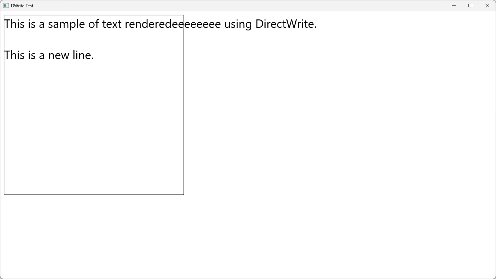

# IDWriteTextFormat::SetWordWrapping

## MSDN
- [IDWriteTextFormat::SetWordWrapping method](https://docs.microsoft.com/en-us/windows/win32/api/dwrite/nf-dwrite-idwritetextformat-setwordwrapping)
- [DWRITE_WORD_WRAPPING enumeration](https://docs.microsoft.com/en-us/windows/win32/api/dwrite/ne-dwrite-dwrite_word_wrapping)

## Description
```cpp
HRESULT SetWordWrapping(DWRITE_WORD_WRAPPING wordWrapping);

typedef enum DWRITE_WORD_WRAPPING {
  DWRITE_WORD_WRAPPING_WRAP = 0,
  DWRITE_WORD_WRAPPING_NO_WRAP = 1,
  DWRITE_WORD_WRAPPING_EMERGENCY_BREAK = 2,
  DWRITE_WORD_WRAPPING_WHOLE_WORD = 3,
  DWRITE_WORD_WRAPPING_CHARACTER = 4
} ;
```

## Result
WRAP


NO_WRAP


EMERGENCY_BREAK


WHOLE_WORD


CHARACTER
